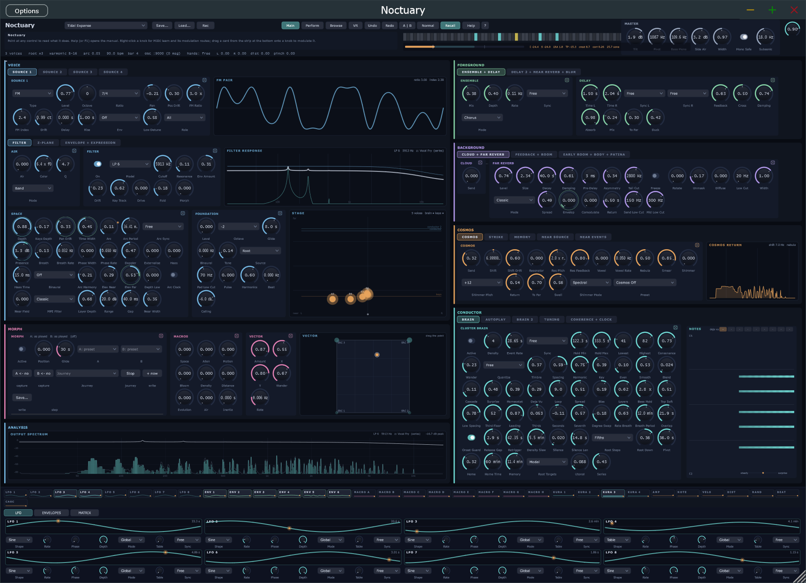
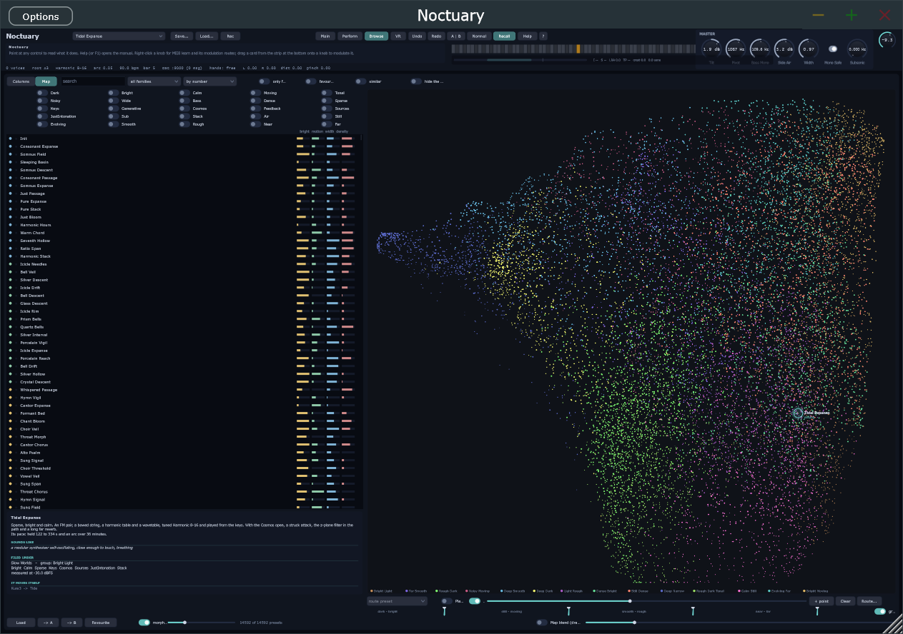
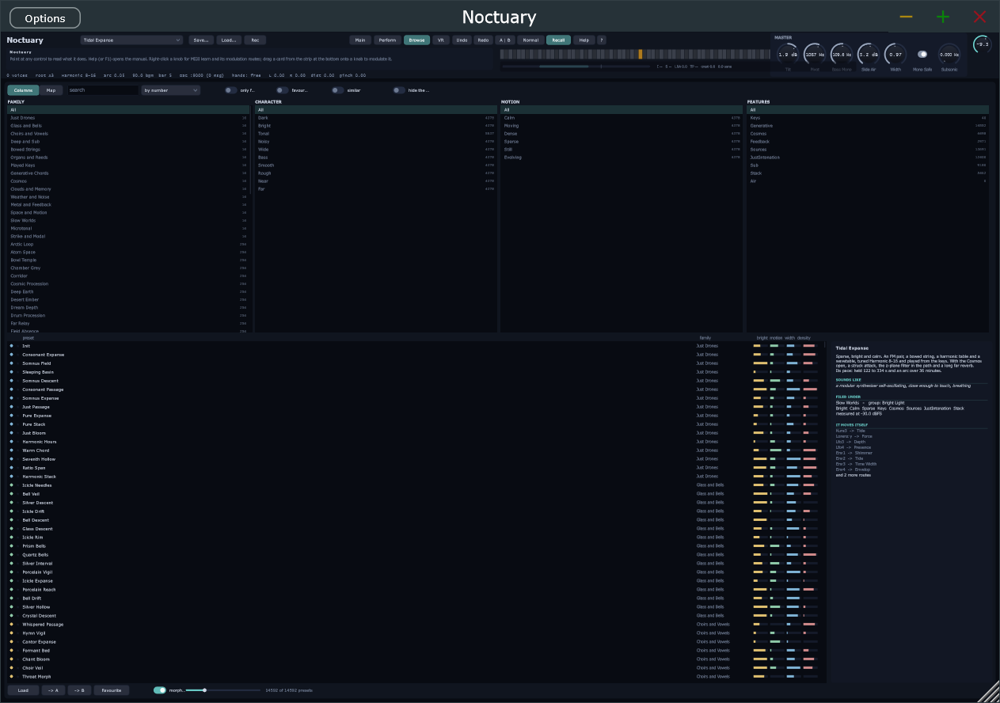

# Noctuary

A drone instrument for slowly breathing clusters, built to one brief: the sleep concerts Robert
Rich has played since 1982 — dense chords in just intonation, no rhythm, changes that take
minutes, a piece that can run all night without repeating and without anyone touching it. Almost
every decision in the instrument follows from taking that brief literally, including the ones that
cost it features other synthesizers have.

**VST3 plugin and standalone application** for Windows (x64). Licence: AGPL-3.0.

<br clear="left" />



## Download

**[Noctuary-2.0.3-Setup.exe](https://github.com/reneweller-coding/Noctuary/releases/download/v2.0.3/Noctuary-2.0.3-Setup.exe)**
installs the standalone, the VST3 and the preset library, and offers to fetch the sample library as
well. Nothing else has to be installed: the runtime is linked in. There is a
**[portable zip](https://github.com/reneweller-coding/Noctuary/releases/download/v2.0.3/Noctuary-2.0.3-portable.zip)**
for anyone who would rather not run an installer, and a
**[manual](https://github.com/reneweller-coding/Noctuary/releases/download/v2.0.3/Noctuary-Manual.pdf)**
— every tab of the panel as a picture, what each knob does, and seven chapters on why the
instrument is built the way it is, with the mathematics and the references.

Requirements: Windows 10 or 11, a 64-bit processor with AVX2 (every x86-64 since 2013), and a VST3
host if you want the plugin. The synthesizer and its 14592 presets take under 100 MB on disk; the
sample library is 100 GB and entirely optional — without it the 256 built-in presets and everything
that does not name a recording still play.

## How it is put together


Every note carries a **distance**: 0 at the ear, 1 the infinite background. Brightness, level,
dryness, presence, the interaural time difference and the reverb it reaches all follow from that
one number, so depth is a landscape rather than an effect. The near plane is dry, bright and close;
the far plane is 100 % wet, dark, wide, and pulled towards the centre while the foreground stays
wide — which is what the ear reads as distance. Since 25.09.2026 the same number also sets how much level a
source loses on its way to the horizon (20 dB by default, the production guide's layering), the gap
between its direct sound and its far reverb (40 ms at the ear, none on the horizon) and how wide its
strands fan out (a third at the ear, all of it far away); every reverb has a high-pass in front of
its input, and the Foundation sits two octaves under the root with the residue harmonics that let a
small speaker hear it.

## The instrument

* **Sixteen voices, four equal source slots each, any slot any of twenty-four types.** Nine carry
  the drone: an additive bank whose partials live their own lives, a harmonic table, a classic
  wavetable of cycles, two-operator FM, granular texture from a recording, a thirty-two-band
  spectral model, a Paulstretch, a bowed string and ten noise colours. The other fifteen belong to
  the near layer below. A Vector reads four slots as the corners of one square, and a
  struck string, wood or metal sits on top. **Each slot enters on its own clock**: up to half a
  minute of silence after the note, then a fade or a sixteen-breakpoint shape of its own, so a
  texture can arrive twenty seconds under a wavetable that is already sounding. A slot can also be
  given a role — the lowest note of the cluster, an inner one, the highest — so the cello under the
  chord is not also the chime on top of it.
* **Two filters.** Ten models with a wavefolder, and a Z-plane morphing filter after the E-mu
  Morpheus with 155 shapes on a cube rather than a square, plus a modal mode that turns it into a
  struck body.
* **A spatial model** with a true interaural time difference, Doppler on moving voices, headphone
  externalisation, air absorption, and a vertical axis heard through the pinna's elevation notch.
* **Three reverb tiers.** A near room; a far reverb of eight feedback lines with four characters
  (classic, scattering, colourless, and a rotating matrix whose modes drift instead of ringing in
  one place) plus diffusion, rotation, envelopment and a co-modulation that breathes the whole
  background to one slow envelope so the foreground is heard past it; and a convolution room that
  takes two impulses and morphs between them inside the one convolution — partitioned in three
  sizes with the long partitions' work spread across the blocks before their deadline, so a minute
  of hall costs about 1.4 % of a core instead of arriving as a spike.
* **A grain cloud in the Aetherizer lineage.** Grains of the recent foreground, transposed and
  dropped into the background: feedback so they hear their own echoes, a shift on every pass of the
  loop, resonators that ring on after their grain has ended, scatter that follows the instrument's
  own tuning rather than a fixed twelve-tone menu, and onsets as a self-exciting process so the
  grains arrive in flocks.
* **The Cosmos**: a parallel path of frequency shifter, tuned resonators, a vowel filter, a spectral
  nebula and a self-regulating shimmer loop. It adds and never replaces.
* **A near layer** with a second, smaller conductor of its own: a flute, a murmur, a bowl, ice,
  drops or a clip playing close to the ear as a note, a gliding phrase or a Berlin-school shift
  register that mutates, plus nine signal sources — whistler, shaker, chime, geiger, tube, Krell,
  beacon, morse, dial. It is a bank beside the sound presets, 108 of them in twelve families, so a
  night's foreground can be chosen once and the backgrounds changed under it.
* **A conductor that plays all night.** The Cluster Brain chooses notes from the scale, places them
  on the planes and holds them for minutes. It judges a chord several ways at once, finds the key it
  has drifted into, makes its clock self-exciting — events that cause events — and tunes each
  arriving note pure against what is already sounding.
* **Thirteen tunings**: twelve just and historical tables, Scala files, and one that sweeps the
  instrument's own roughness curve and puts a degree wherever it dips, so the tuning follows the
  sound.
* **Modulation everywhere**: eight LFOs, six hand-drawn envelopes, eight macros, four coupled
  Kuramoto oscillators, a Lenia field, the Lorenz and Rössler attractors on a scale of minutes,
  aftertouch, wheel and slide — forty-nine sources through a matrix of thirty-two routes onto any
  knob, including the modulators' own.
* **No compressor, no limiter, no dithering.** What you hear is the dynamics of the drone.

Every rate that can sit on a grid has a sync choice beside its free knob, from 64 bars to 1/32 with
dotted and triplet values. Every voice, plane and effect answers to MIDI, MPE, OSC or hand
tracking through the same parameters.

## The library



**14592 presets** — 256 compiled into the instrument and 14336 in 56 packs, each pack written in the
spirit of an artist who works in one corner of the drone repertoire. Nothing in the library is
described; everything is measured. Every preset is rendered offline for a minute and nine
descriptors are taken from the render: how bright, how dense, how wide, how far the sound travels
over that minute, how rough its partials are against each other, how much of it comes back from the
far planes. Those nine become the browser's columns, the level matching, and the position on the
map.

The map is a free cloud laid out by springs on a nearest-neighbour graph, dense where the library
repeats itself and empty where it is thin, turned until dark is left and evolving is up, and
coloured by groups the same nine numbers fall into. Put the cursor between points with map blend on
and the instrument glides to a blend of the presets around it — a sound nobody saved. A point on the
map is where a preset sounds, not where somebody put it.



Sort and filter by family, character, motion and features, or search; star what you like and the
favourites rise to the top of any sort and ring gold on the map. A **route** walks the map by
itself between waypoints. A **journey** is a list of presets for an evening that plays itself —
each held for a time drawn from a range, then crossfaded into the next — and 119 of them ship with
the library, a journey and a night for every pack and a crossing for every family.

Beside the presets: **8686 samples** (5748 textures and 2938 field recordings, every one of the
latter made seamless by construction), **2191 wavetables** on three shelves, and **1100 impulse
responses** — not only rooms but tuned partial banks that ring in key, inharmonic modal metal,
reversed swells, combs and pipes, and struck objects cut from the recordings, 421 of them as a/b
pairs for the room morph. All of that is generated for this instrument, and the clips carry the
artist they were written for, so a pack plays the material made for it. Beside it sits an archive
of 931 recordings that are not generated at all: Mars wind and marsquakes and the Webb
sonifications from NASA, 724 cylinder and early-radio transfers from the Library of Congress, and
120 shortwave and numbers-station captures — all public domain, each one credited to its source in
`Library/Archive/SOURCES.md`.

## Layout

| Directory | What | Depends on |
|---|---|---|
| `Core/` | The whole synthesizer: parameters, tuning, voices, spatial routing, effects, conductor, presets, engine. Pure C++20, no allocations while rendering. | nothing |
| `Plugin/` | JUCE wrapper: VST3 + standalone, the panel, preset browser and map, state. | JUCE 9 (fetched by CMake) |
| `Tools/render/` | `ambient_render`: offline renderer to WAV with per-second measurements, journeys and a rule-book audit of the conductor. | Core |
| `Tools/library/` | The library pipeline: generates, renders, measures and lays out the presets. | Python, numpy |
| `Tests/` | The self test, the host test, the race test and the SIMD path tests (below). | Core, JUCE for the host test |
| `Deploy/` | `build_release.ps1` builds, checks and packages; `Noctuary.iss` is the installer. | Inno Setup 6+ |
| `Quest/` | A native Meta Quest app against the same core: OpenXR, hand tracking, Oboe. Builds; not yet run on a headset. | NDK, OpenXR, Oboe |
| `docs/concept.md` | Sound-design and architecture notes. | |
| `docs/Doxyfile` | Doxygen configuration for the C++ sources (below). | Doxygen |

## Build

```bash
cmake -S . -B build -G "Visual Studio 18 2026" -A x64
cmake --build build --config Release
```

Outputs: the VST3 under `build/Plugin/Noctuary_artefacts/Release/VST3/` (copy the folder to
`C:\Program Files\Common Files\VST3`), the standalone beside it, `ambient_render` under
`build/Tools/render/Release/`, and the tests under `build/Tests/Release/`. The first configure
downloads JUCE. `-DAMBIENT_BUILD_PLUGIN=OFF` builds only the core and the tools, which needs no
JUCE and also builds on Linux.

### Reference documentation

Every C++ file in `Core/`, `Plugin/`, `Quest/`, `Tools/render/` and `Tests/` is documented in
Doxygen form, in the same style as [Phosphene](https://github.com/reneweller-coding/Phosphene): a
`@file` block that explains what the file is for and why it is built the way it is, a block on every
class, function and constant, and `///<` on every member. The comments carry the design history
(measurements, dates, what was tried and rejected), so the generated pages are the place to read the
instrument's reasoning rather than a list of signatures.

```bash
doxygen docs/Doxyfile
```

writes the HTML to `build/doxygen/html/index.html`, with this README as the main page. The
configuration lives in `docs/Doxyfile` and needs Doxygen 1.9 or newer; Graphviz is not required.

## Checking it

`ambient_selftest` measures the instrument: tuning, envelopes, the conductor, determinism, and the
largest sample-to-sample step of every render it makes. `ambient_hosttest` measures the plugin
around it — rates from 44.1 to 96 kHz and blocks from 16 to 2048 with mismatched short blocks
between them, a state that comes back exactly as it went out, programs changed while audio runs,
and four seconds of two threads writing every parameter while it plays. Run it **without**
`AMBIENT_MUTE`: it measures levels. `ambient_racetest` renders on one thread while another changes
everything a window can change, as fast as it can; it exists because nearly every serious fault
this instrument has had was a handover between those two threads.

```bash
build/Tests/Release/ambient_selftest.exe
build/Tests/Release/ambient_hosttest.exe
build/Tests/Release/ambient_racetest.exe 4
```

The hot inner loops — the partial bank, the grain ring, the convolution — exist as AVX2, NEON and
scalar. `ambient_banktest`, `ambient_convtest` and their `_neon` and `_scalar` variants check that
the three agree sample by sample, and each one names the path it actually took, because a test that
compares a vector path with a scalar one passes trivially when no vector path was compiled.
`AMBIENT_FUZZ=1` turns the host test into a tool: it sets every parameter at random, then moves one
section at a time while a chord plays, and names any section whose sound stops being a number.

Before a release, two more that do not live here. [pluginval](https://github.com/Tracktion/pluginval)
at strictness 10 exercises the VST3 through the format itself. The thread sanitizer exists only on
Linux, which is where the framework-free core comes in:

```bash
cmake -S . -B build-tsan -DAMBIENT_BUILD_PLUGIN=OFF -DCMAKE_BUILD_TYPE=RelWithDebInfo \
      -DCMAKE_CXX_FLAGS="-fsanitize=thread -g -O1" -DCMAKE_EXE_LINKER_FLAGS="-fsanitize=thread"
cmake --build build-tsan -j && setarch $(uname -m) -R ./build-tsan/Tests/ambient_racetest 60
```

## Releasing

```powershell
powershell -File Deploy\build_release.ps1
```

Builds in its own tree with the runtime linked in and AVX2 on, runs the tests in that exact
configuration, refuses to package a binary that still asks for any redistributable — Microsoft's or
Intel's — and leaves a setup and a portable zip in `Deploy\out` with their SHA-256 sums.

Releases are built with Intel's oneAPI compiler, which is about a fifth faster through the plugin
under load than MSVC. It puts a generative instrument on a different floating-point trajectory, so
it plays a different take of the same patch; over sixty presets the descriptors the map is laid out
from move by 5 % of a typical distance between two presets and the loudness by a hundredth of a
decibel, so the map and the loudness matching hold. `-Toolchain msvc` builds the same source with
Microsoft's compiler, for comparing the two rather than for packaging.

The sample library is 100 GB of FLAC split across 57 archives on its own release tag; the installer
downloads them with your consent and verifies each against a manifest, and the portable zip points
at them in its README.

## What it does not do

It has no compressor, no limiter and no dithering, and does not intend to — mastering is a separate
craft with its own tools. The four-pole ladder filter is not zero-delay. The Quest application
builds against the same core and has not yet been run on a headset. The spectral model is
thirty-two bands and one partial per band, so a dense chord in one band comes back as its loudest
member plus noise. The manual's last chapter lists the rest of the caveats in full, because the
instrument's manual is also its record.

## Licence

AGPL-3.0. The generated samples, wavetables and impulse responses are the author's own and ship
under the same terms. The archive recordings are public domain and credited file by file in
`Library/Archive/SOURCES.md`; the only measured rooms in the impulse folder are the Aula Carolina
responses from the Aachen AIR database, under their own permissive licence, credited in
`Library/Impulses/CREDITS.txt`. No material is sampled from, or affiliated with, any of the artists
the preset packs are named in the spirit of.
